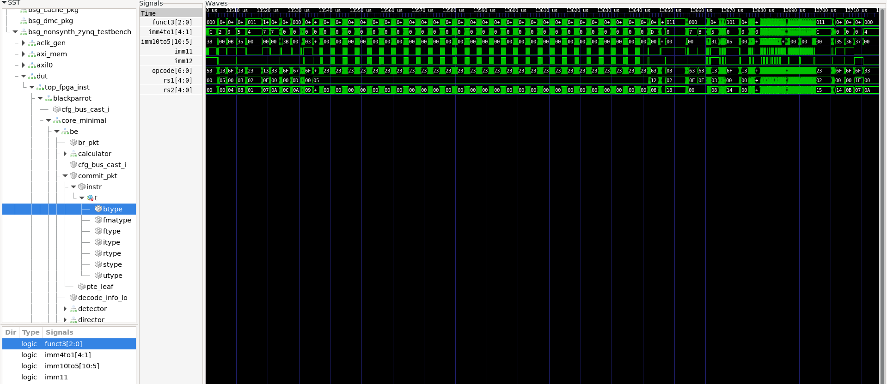
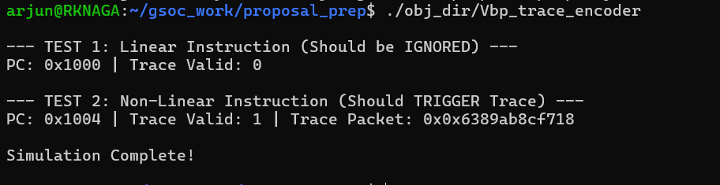

# GSoC 2026 Prep: RISC-V Trace Encoder for BlackParrot

This repository contains my preparatory RTL design, architectural research, and cycle-accurate co-simulation for the **FOSSi Foundation GSoC 2026** project: *RISC-V Trace Implementation into ZynqParrot*.

## Objective
The goal of this prep work is to design the frontend interface for a hardware trace encoder (`bp_trace_encoder.sv`) that tracks non-linear control flow (branches and jumps) within the BlackParrot processor backend. By filtering linear execution and only compressing discontinuous paths, the encoder drastically reduces the bandwidth required to export trace data to the Zynq Processing System.

## Signal Discovery & Methodology
To avoid tracing linear `PC+4` execution, the encoder must monitor the commit stage for discontinuities. Using Verilator co-simulation and GTKWave on the `black-parrot-minimal-example`, I mapped the BlackParrot backend (`core_minimal/be`) and isolated the required signals:

1. **Trigger:** `commit_v_o` (Valid instruction retirement)
2. **Payload:** `bp_be_commit_pkt_s` (Contains the PC and instruction bits)
3. **Branch Detection:** Extracted `instr.t.btype` and `instr.t.jtype` directly from the commit packet to trigger the trace generation.

*(Screenshot of the BlackParrot Backend commit packet inside GTKWave showing the `btype` isolation)*


## Integration Plan
The drafted SystemVerilog interface is designed to be instantiated directly alongside the commit logic (e.g., within `bp_be_top.sv`). It intercepts the `commit_pkt`, filters the instruction opcode (e.g., `1100011` for B-Type), calculates the PC Delta, and generates a valid trace packet to be routed via AXI to the Zynq PS.

---

## Reproducing the Verilator Co-Simulation

This repository includes a cycle-accurate C++ testbench (`sim_main.cpp`) to verify the SystemVerilog RTL (`bp_trace_encoder.sv`) using Verilator. The simulation proves the encoder successfully filters out linear control flow (e.g., standard ALU operations) and correctly triggers trace packets only on non-linear branches.

### Prerequisites
Ensure you have Verilator installed on your Linux system:
```bash
sudo apt-get update
sudo apt-get install verilator


### Build and Run
1. Translate SV to C++ and link the testbench (ignoring unused upper instruction bits):
```bash
verilator -Wall -Wno-UNUSEDSIGNAL --cc bp_trace_encoder.sv --exe sim_main.cpp

2. Build the executable:
```bash
make -j -C obj_dir -f Vbp_trace_encoder.mk Vbp_trace_encoder

3. Run
```bash
./obj_dir/Vbp_trace_encoder

### Output

*(Screenshot of the Output Generated)*

